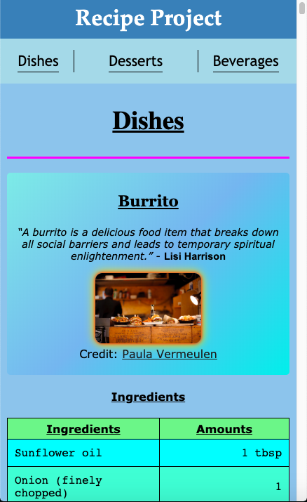
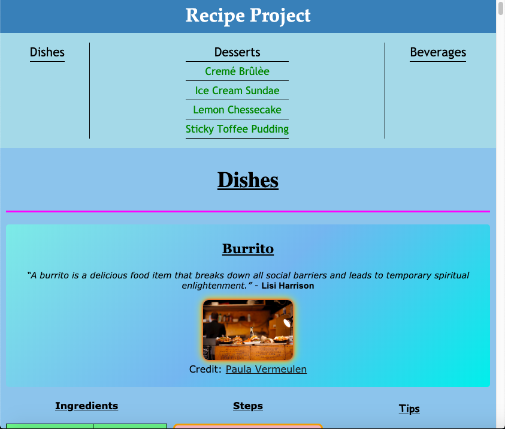
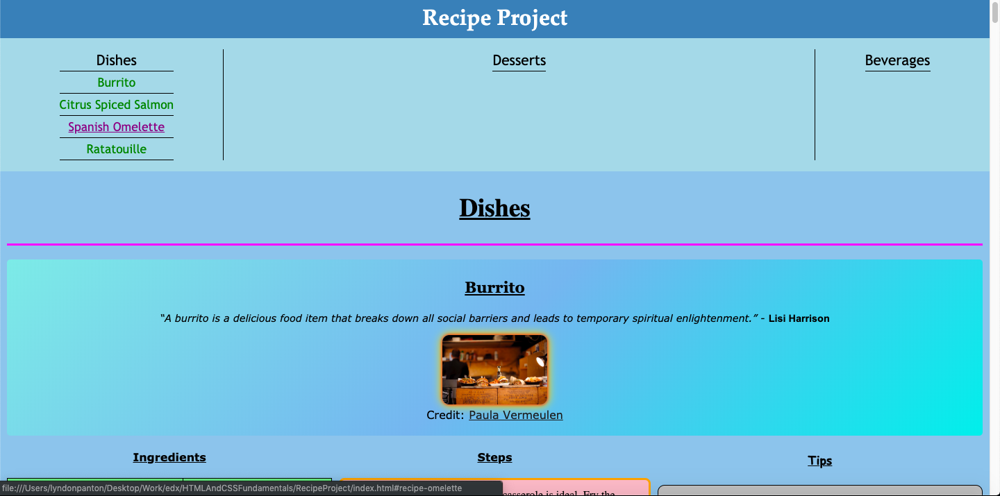
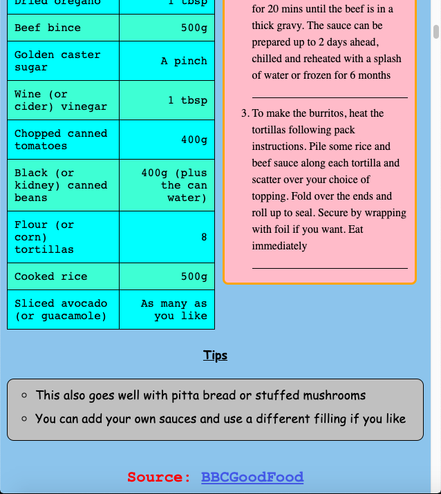
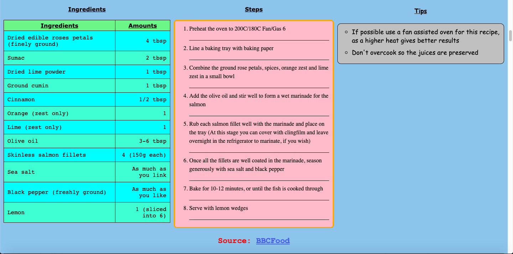

# Recipe Project

## How To Open

1. Open the project's downloads folder
2. Right click on the file name _index.html_
3. Chose the _open with_ option
4. Open the file in the browser of your choice

## How To Use

- This project has 12 recipes in it
- Use the navigation bar to view each recipe
- The recipes have introductions, ingredients lists, steps and a link to the source recipe

## Requirements

- This project requires a browser to run
- The browser must have Javascript available and enabled

## Preview

